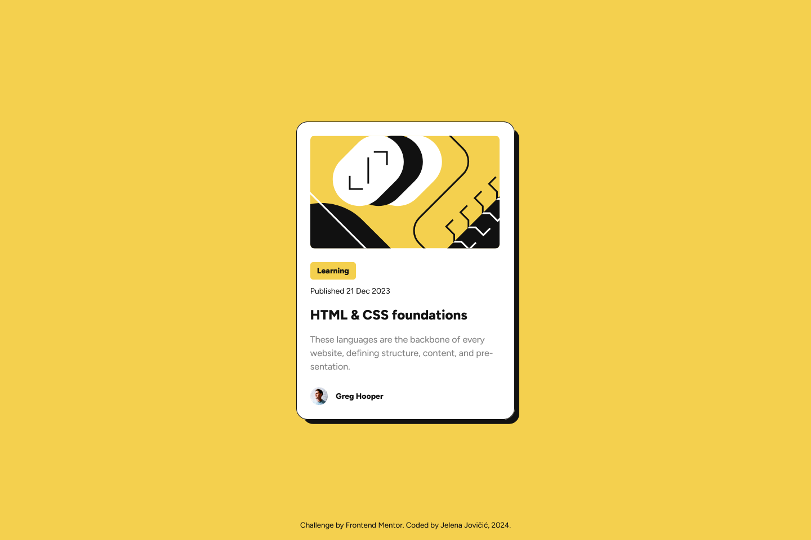

# Frontend Mentor - Blog preview card solution

This is a solution to the [Blog preview card challenge on Frontend Mentor](https://www.frontendmentor.io/challenges/blog-preview-card-ckPaj01IcS). Frontend Mentor challenges help you improve your coding skills by building realistic projects. 

## Table of contents

- [Overview](#overview)
  - [The challenge](#the-challenge)
  - [Screenshot](#screenshot)
  - [Links](#links)
- [My process](#my-process)
  - [Built with](#built-with)
  - [Observations](#obsevations)
  - [Useful resources](#useful-resources)
- [Author](#author)
- [Acknowledgments](#acknowledgments)

## Overview

### The challenge

Users should be able to:

- [x] See hover states for interactive elements

### Screenshot

### Links

- [Solution](...)
- [Live](https://je-jo.github.io/blog-preview-card/)

## My process

### Built with

- Semantic HTML5 markup
- CSS custom properties
- Flexbox
- CSS Grid
- Mobile-first workflow

### Observations

I used this small project to get back on track after a long pause.

### Useful resources

- [google web fonts helper](https://gwfh.mranftl.com/fonts) - A Hassle-Free Way to Self-Host Google Fonts.
- [Box Shadows](https://box-shadow.dev/) - a simple tool to generate box shadows.
- [Fluid Typography Tool](https://fluidtypography.com/) - for easily calculating fluid font sizes.
- [Solutions to Replace the 12-Column Grid](https://moderncss.dev/solutions-to-replace-the-12-column-grid/) - a great article by Stephanie Eckless on fluid grid containers.
- [PerfectPixel](https://www.welldonecode.com/perfectpixel/) - a Chrome extension for comparing website with design image.

## Author

- [Github](https://github.com/je-jo)
- [LinkedIn](https://www.linkedin.com/in/jelena-jovicic/)
- [Frontend Mentor](https://www.frontendmentor.io/profile/je-jo)
- [Codepen](https://codepen.io/je-jo)
- [Twitter](https://twitter.com/jelena_jo_)